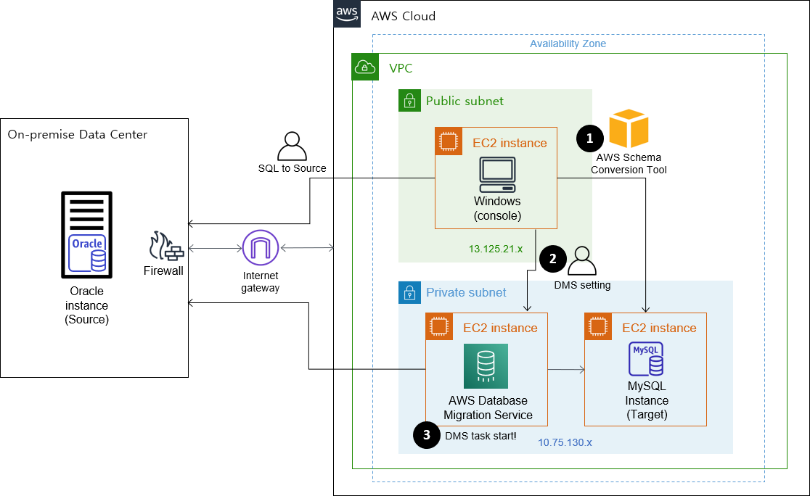
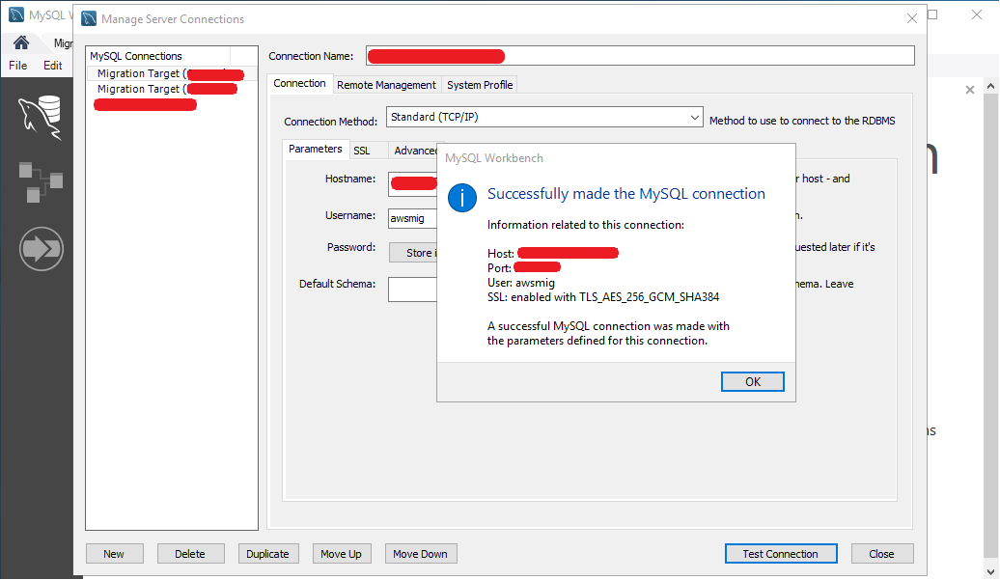

---
# Common-Defined params
title: "생동감 있는 개발 조직에서 격변의 시간을 보낸 2022년 회고"
date: "2022-12-30"
description: "생동감 있는 개발 조직에서 격변의 시간을 보낸 2022년 회고"
#images: ['img/avatar.jpg']
categories:
  - "story"
tags:
  - "회고"
  - "Retrospect"
#menu: side # Optional, add page to a menu. Options: main, side, footer

# Theme-Defined params
#thumbnail: "img/avatar.jpg" # Thumbnail image
lead: "생동감 있는 개발 조직에서 격변의 시간을 보낸 2022년 회고" # Lead text
comments: true # Enable Disqus comments for specific page
authorbox: true # Enable authorbox for specific page
pager: true # Enable pager navigation (prev/next) for specific page
toc: true # Enable Table of Contents for specific page
mathjax: true # Enable MathJax for specific page
sidebar: "right" # Enable sidebar (on the right side) per page
widgets: # Enable sidebar widgets in given order per page
  - "recent"
  - "taglist"
---

# 도입

2022년은 나에게 하나의 새로운 시도였고 흥미진진했고 역동적이었다. SNS 상에 많은 분들 회고 글을 보면서 '나도 써볼까? 잼있겠는데?' 생각만 했었는데 올해부터는 나도 회고 글 쓰는 사람이 되어보려고 한다.

# 새 술은 새 부대에

신규 팀을 빌드하였다. 2020 ~ 2021년까지는 Lead Engineering 조직 내에서 SW 개발 일을 했었고 2022년부터는 보다 전문적이고 집중적으로 Service Development 하기 위해 참여 의사가 있는 크루들을 모으고 신규 팀을 만들어달라고 회사에 요청했고 결국 `서비스개발팀`이 만들어졌다. (두둥딱)

클라우드메이트에 입사하고 난 후부터 사내 또는 고객사에 적절한 애플리케이션을 서비스하여 생산성을 끌어올릴 수 있겠다는 생각을 많이 했었고, 나 혼자만의 생각들이 실제 실무자들에게 필요한 것인지 검증하기 위해 사내 여러 동료들로부터 어떤 애플리케이션이 업무 상 필요한지 디스커션을 많이 하면서 정보를 모았다. 그런 과정을 통해서 2022년 서비스개발팀이 해야할 일에 대해서 경영진에게 보고하고 재가를 받았다. 일을 크게 벌려놓고는 항상 근심이 많다.

`서비스개발팀`에서 해야할 일들은 다음과 같았다.
1. 신규 서비스 런칭
 - IAM 서비스
 - 영업관리 서비스 (이하 SalesOps)
 - 챗봇 서비스 (이하 Colson[콜슨])
2. 캐시 엔진 솔루션 개발
3. 기존 애플리케이션 유지보수
4. 고객사 애플리케이션 개발
5. 고객사 개발 컨설팅
6. 개발 경험 사내, 사외 전파

# 신규 서비스 런칭

### IAM
사내 임직원 뿐만 아니라 OAuth2.0 통해서 외부 고객사에서도 사용할 수 있는 계정 및 권한 관리 시스템이 꼭 필요했다. 그래서 IAM 서비스부터 개발하였고 KeyCloak과 Hashicorp Vault를 사용해서 사용자, 역할, 권한, 시크릿을 관리할 수 있는 웹애플리케이션을 출시했다. 이 과정에서 RBAC (Roll Base Access Control) 에 대해 깊이 고민 후 적용하게 되었고, OAuth2.0은 반드시 HTTPS 연결을 해야겠다고 판단했다.

### SalesOps
IAM 출시 이후에 바로 이어서 SalesOps라고 하는 영업관리 웹애플리케이션 개발에 착수하였다. SalesOps는 영업 조직의 업무를 효율화하고 fileless한 업무 환경으로 가기 위해서 시작하였고, SalesOps에는 영업 관련된 기능과 CRM 일부 기능이 포함되어 2022년 12월까지 CBT(Closed Beta Test)를 진행했고 2023년 초에 정식으로 프로덕션하기 위해 막바지 작업이 한참이다.

### Colson
SalesOps를 개발하면서 동시에 Colson(콜슨) 챗봇 개발 역시 진행했다. Colson은 사내 다양한 질의응답, 재택/휴가 여부, 주변 식당 검색 등 을 챗봇을 통하여 빠르고 간편하게 확인할 수 있게 하기 위하여 기획하였다. Colson은 Teams 메신저 상에서 이용할 수 있는 챗봇이며 9월에 서비스를 시작하여 식당 조회, 근무지(재택,휴가,외근) 등록 및 조회, 생일자 복지 알림, 익명 칭찬 메시지 전달, 기술지원 업무 알림 등 다양한 서비스를 제공하고 있다. 클라우드메이트 구성원들로부터 좋은 평가를 받고 있다고 나는 생각한다. (과연..?)

---

신규 3가지 서비스를 런칭하면서 느꼈던 점은 굉장히 많은데 조금 요약하자면, 하나의 서비스를 최초 기획, 최종 오픈할 때까지 정말 많은 구성원들에게 서비스 소개를 자주 해야 했었다. 나는 최대한 쉽게 풀어서 설명하려고 했으나 나의 설명 능력 부족으로 인해 듣는 사람은 다르게 해석하거나 그 서비스를 다른 시각에서 바라보는 경우가 많았다. 그래서 "이건 이런 서비스에요. 추가로 원하는게 있나요? 만들어드릴께요." 형태의 대화를 정말 많이 했다. 추가적으로 이건 "가장 큰 결실"이라고 느꼈던 것은 웹 풀스택에 걸쳐서 클라우드메이트 만의 웹 개발 기준 프레임워크를 (아직 부족하지만) 제시했다는 거다. 이제 이 기준 프레임워크에 맞추어 다양한 서비스 또는 기능 추가를 조금 더 단시간에 적은 노력으로 할 수 있는 기틀을 마련했다고 생각한다.

# 좋았던 점

개인적으로 2022년 가장 큰 즐거움은 팀 크루 10명이 어떻게 하면 즐겁게 일 할 수 있을까? 에 대해서 깊이 고민하고 즐겁고 경쾌하게 서로 업무할 수 있는 환경이 어느 정도는 만들어진 것 같아 그 점이 가장 좋은 기억으로 남는다. 항상 나에게 기술적 조언과 경험 전달을 아끼지 않고 나의 힘든 점을 보듬어주려고 애써주시는 성민님, 인자한 미소와 함께 "나도 이런거 할 수 있으니까 시켜주세요." 라며 내 부담을 덜어주려고 하시는 원균님, KeyCloak과 프리파라, 포켓몬의 광팬이면서 다양한 부분에서 엄청난 기여를 해주신 광석님, React의 열렬한 지지자이면서 프론트엔드 개발과 프론트엔드 프로젝트의 중심을 잡아주신 그리고 종무식 때 잠시 켜졌던 카메라를 통해 cute한 땡땡이 잠옷을 보여주신 진호님, 타지에서 원격근무하면서도 항상 번뜩이는 아이디어와 개발 센스로 놀라운 퍼포먼스를 보여주시는 진혁님, Airflow를 魔개조하시고 다양한 개발언어를 넘나들며 백엔드에서 다양한 기여해주신 우분투의 신 영빈님, 묵묵히 맡은 페이지를 개발 완수해 내시며 점점 더 개발 가속도가 붙는게 보이는 우윳빛깔 예원님, 생소할 수 있는 프론트엔드 포지션에서 무서운 속도로 성장하고 계시는 효도르 a.k.a 효줌마 효연님, "닷넷이 미래다"라는 격언과 함께 MVVM XAML의 황제이면서 최근에는 REST API를 무서운 속도로 개발하고 계시는 상훈님까지.. 이건 개인의 회고이면서도 팀 구성원에게 감사한 마음을 표현하는 글이다. (수줍수줍)

기술적으로는 Azure 서비스를 적극 활용해서 경험치를 쌓았고 (Container Apps 이거 좋더라.) 닷넷 애플리케이션을 리눅스에서 서빙하면서 다양한 경험을 해볼 수 있어서 좋았다.

# 힘들었던 점

신규 개발과 기존 애플리케이션의 유지 보수를 오간다는 것이 내 두뇌에서 상당한 context switching cost가 발생해서, 일정 관리하는데에 심혈을 기울였다. 추가로, 종종 외근나가서 어설픈 초식 몇가지를 선보이며 나의 경험을 선보여야 해서 더욱 힘들었다.

# 아쉬웠던 점

다양한 개발 환경을 적극적으로, 온전히 내 것으로 만들지 못한 것. 2023년에는 Go를 학습하여 내가 짠 Go 애플리케이션을 프로덕션 서비스에 적용해볼 생각이다. 프로젝트 매니징 관점에서는, 코드 리뷰를 활발하게 하는 문화를 정착시키지 못하고 프로덕트 출시에 급급했던 면이 있다고 생각한다. 2023년에는 코드 리뷰를 활성화 시키도록 노력할 생각이다. 

# 2023년도 계획

---

누추한 2022년 회고 읽어주셔서 감사합니다.

## 마이그레이션 아키텍쳐

1. 작업콘솔의 SCT에서 소스의 스키마를 DDL 형태로 로드하여 타겟에 적용합니다.
1. AWS 콘솔에서 DMS 내에 필요한 리소스를 셋팅 합니다. (복제 인스턴스, 소스/타겟 엔드포인트 생성)
1. DMS 내에 여러 마이그레이션 태스크를 소스 스키마 단위로 생성하고 일괄 실행합니다.
1. 소스, 타겟에 직접 SQL을 실행하여 전체 오브젝트 현황을 비교하고 검증합니다.

## 1. 작업 콘솔 셋팅

자, 이제 사전 검토했고 아키텍쳐 파악했으니, 실제로 시작해봅시다.

3. 작업콘솔에서 타겟 검증을 위하여 WorkBench 설치 후 타겟DB 접속 테스트를 합니다.

4. 작업콘솔에서 스키마 이관을 위하여 SCT 설치 후 소스, 타겟 접속 테스트를 합니다. SCT > New Project wizard IU 입니다. Source engine 의 기본값이 Oracle인 것이 흥미롭습니다.

## 2. 타겟 DB 셋팅

### 2.1. Buffer pool

DMS가 타겟DB에 값을 쓸 때 버퍼캐쉬 크기가 처리 성능을 크게 좌우합니다. 디폴트값(128MB)에서 일시적으로 서버 메모리 한도 내에서 최대한으로 설정하도록 권장 드립니다. 금번 프로젝트의 경우 64GiB 로 설정하여 진행했습니다.


-- buffer pool size 확인 (GiB)
SELECT @@innodb_buffer_pool_size / 1024 / 1024 / 1024;


※ Innodb buffer pool size가 쓰기 성능에 얼만큼 영향이 큰지 테스트한 블로그 링크 참고 바랍니다.
출처: ↗

### 2.2. Timezone

타겟 EC2 에 MySQL 바이너리 설치한 초기 상태에서는 timezone 을 소스와 동일한 timezone 으로 설정해주어야 합니다. 먼저 소스 DB의 timezone을 확인합니다.


SELECT   DBTIMEZONE,
   SESSIONTIMEZONE
FROM  DUAL;


---
`eof`