---
# Common-Defined params
title: "SQL PASS Korea 세미나 발표 - Azure SQL database의 Geo Replica와 Managed Instance의 Failover group을 통한 CQRS 구현"
date: "2023-03-17"
description: "SQL PASS Korea 커뮤니티의 초청을 받아 컨퍼런스 발표"
images: ['..\resource\images_pass_korea_azure_sql\KakaoTalk_20230917_205807945_04_down.jpg']
categories:
  - "DB"
  - "Story"
tags:
  - "Azure SQL"
  - "PASS Korea"
  - "Failover"
  - "Failover group"
#menu: side # Optional, add page to a menu. Options: main, side, footer

# Theme-Defined params
#thumbnail: "images\20230616_154117362_05_600_450.jpg" # Thumbnail image
#thumbnail: "content\posts\2023-03-17-SQL-PASS-Korea-Seminar-Azure-SQL-Failover-group\images\20230616_154117362_05_600_450.jpg"
#thumbnail: "..\resource\images_pass_korea_azure_sql\KakaoTalk_20230917_205807945_04_down.jpg"
lead: "SQL PASS Korea 커뮤니티의 초청을 받아 컨퍼런스 발표" # Lead text
comments: true # Enable Disqus comments for specific page
authorbox: true # Enable authorbox for specific page
pager: true # Enable pager navigation (prev/next) for specific page
toc: true # Enable Table of Contents for specific page
mathjax: true # Enable MathJax for specific page
sidebar: "right" # Enable sidebar (on the right side) per page
widgets: # Enable sidebar widgets in given order per page
  - "recent"
  - "taglist"
---

# 도입

몇달 전에 시퀄로 김정선 이사님께 내가 "발표할 일 있음 연락주세요" 말씀 드렸다가 "발표해보시겠어요?" 막상 제안 받으니까 걱정되고 두렵다. 비록 나는 DB 전문가는 아니지만 무장적 해보기로 했다. (어떻게든 되겠지ㅎ)

# 세미나 정보

↗

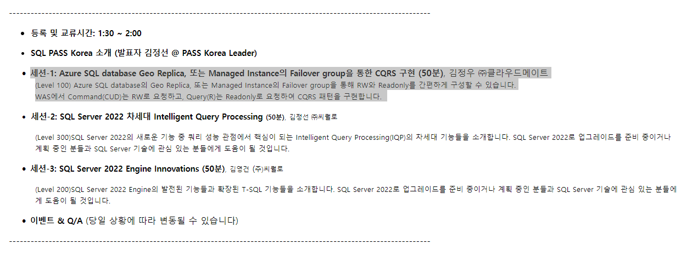

- 등록 및 교류시간 (PM 1:30 ~ 2:00)
- SQL PASS Korea 소개 (발표자 김정선 @ PASS Korea Leader)

- 세션-1: Azure SQL database Geo Replica, 또는 Managed Instance의 Failover group을 통한 CQRS 구현 (50분), 김정우 ㈜클라우드메이트
(Level 100) Azure SQL database의 Geo Replica, 또는 Managed Instance의 Failover group을 통해 RW와 Readonly를 간편하게 구성할 수 있습니다.
WAS에서 Command(CUD)는 RW로 요청하고, Query(R)는 Readonly로 요청하여 CQRS 패턴을 구현합니다.

- 세션-2: SQL Server 2022 차세대 Intelligent Query Processing (50분), 김정선 ㈜씨퀄로
(Level 300)SQL Server 2022의 새로운 기능 중 쿼리 성능 관점에서 핵심이 되는 Intelligent Query Processing(IQP)의 차세대 기능들을 소개합니다. SQL Server 2022로 업그레이드를 준비 중이거나 계획 중인 분들과 SQL Server 기술에 관심 있는 분들에게 도움이 될 것입니다.

- 세션-3: SQL Server 2022 Engine Innovations (50분), 김영건 (주)씨퀄로
(Level 200)SQL Server 2022 Engine의 발전된 기능들과 확장된 T-SQL 기능들을 소개합니다. SQL Server 2022로 업그레이드를 준비 중이거나 계획 중인 분들과 SQL Server 기술에 관심 있는 분들에게 도움이 될 것입니다.

- 이벤트 & Q/A (당일 상황에 따라 변동될 수 있습니다)

# 세션 주요 내용

Architecture comparison - Azure SQL Database Geo Replica VS Failover group

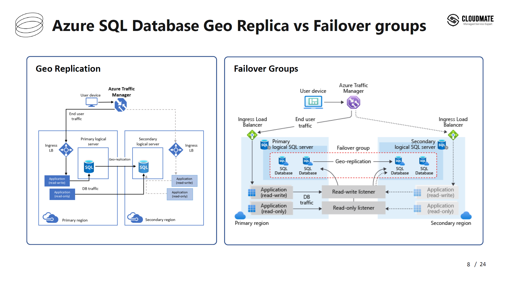

Feature comparison - Azure SQL Database Geo Replica VS Failover group

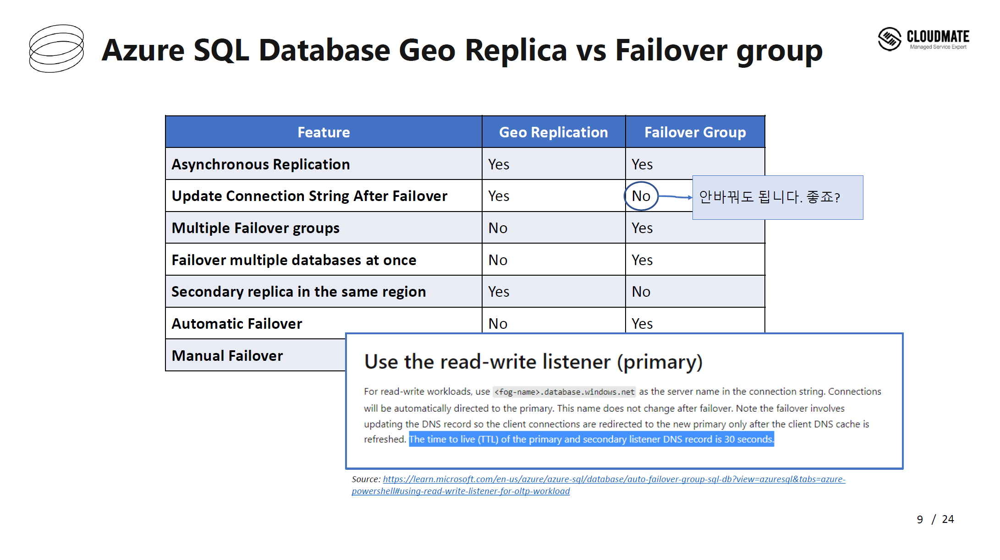

CQRS Pattern - Event Sourcing Pattern.png

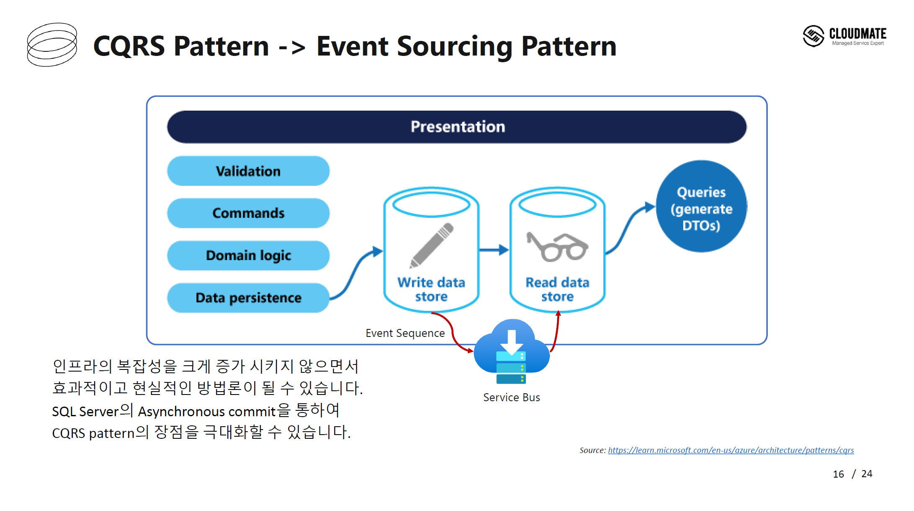

Micro service Architecture Basic Design

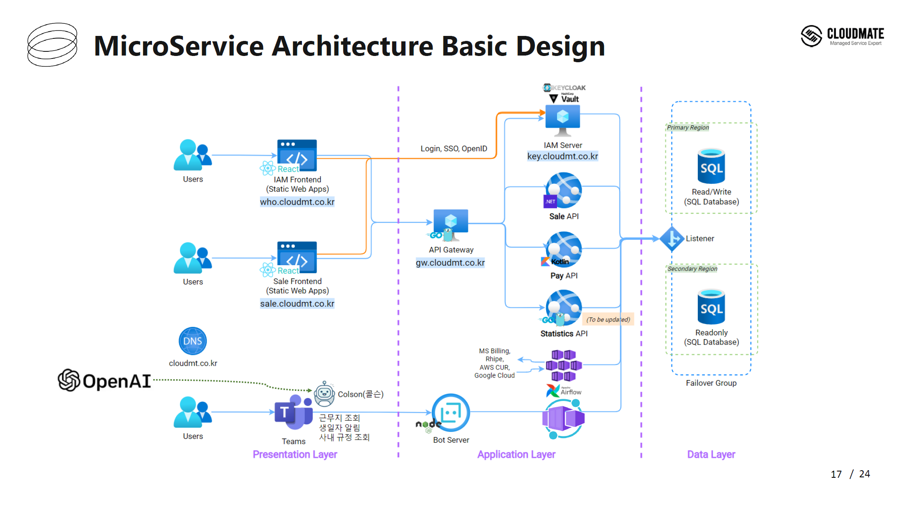

Azure SQL Database의 Geo Replica 및 Failover Group demo 구성

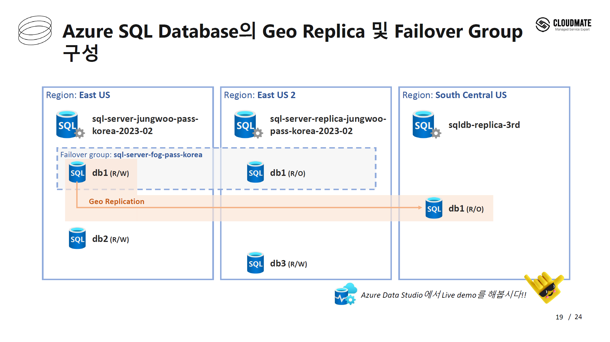

Azure SQL Managed Instance의 Failover Group demo 구성

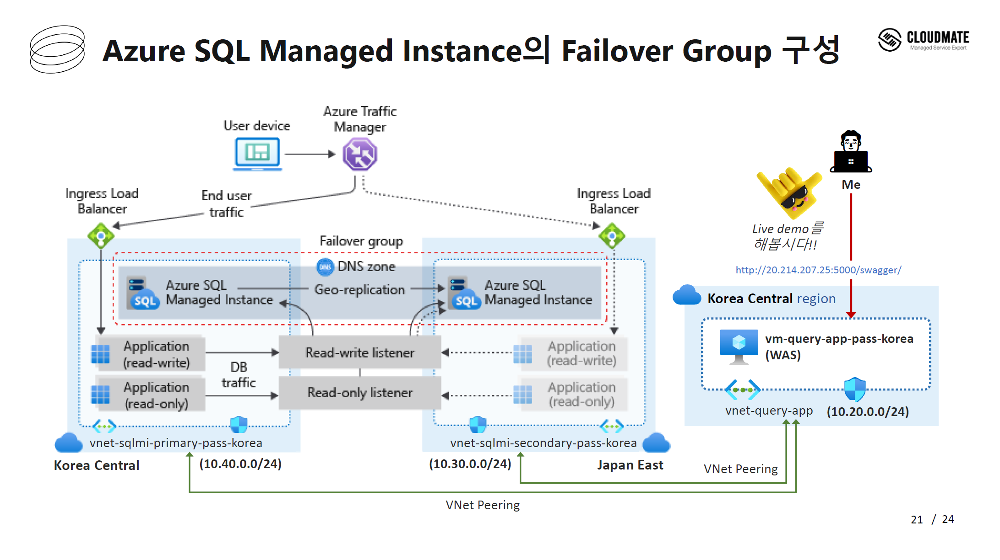

Azure SQL Managed Instance의 Failover Group Insights

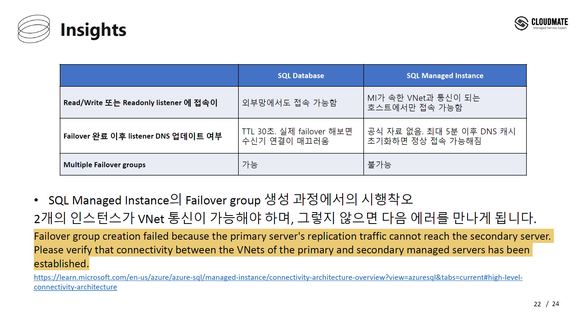

# 스냅 사진

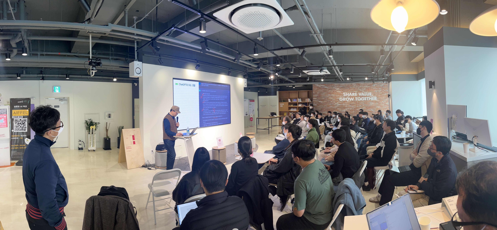

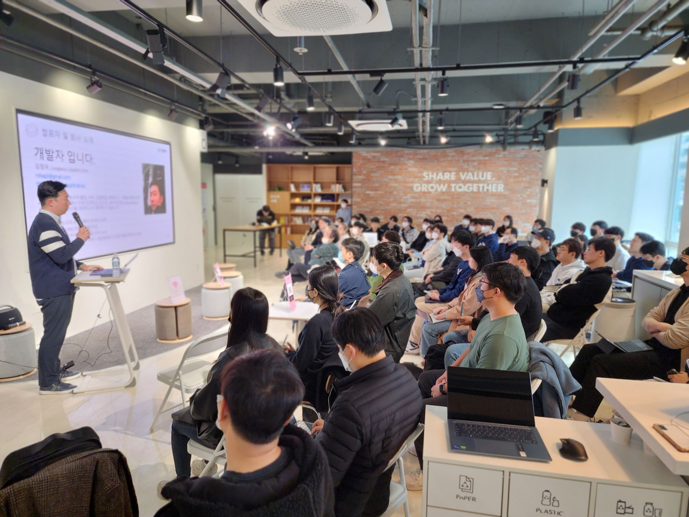

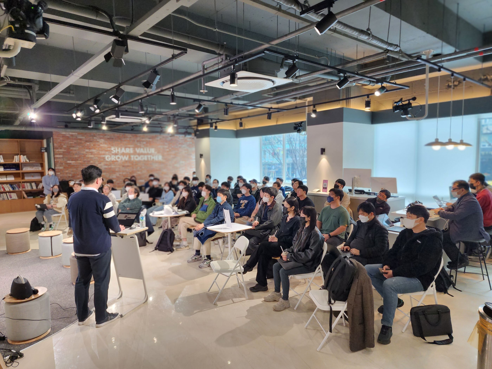

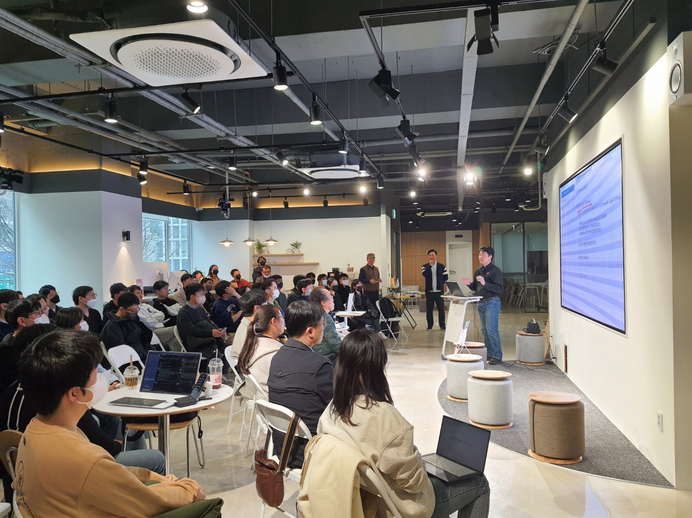


# 발표자료 - Azure SQL database의 Geo Replica와 Managed Instance의 Failover group을 통한 CQRS 구현

↗

<!--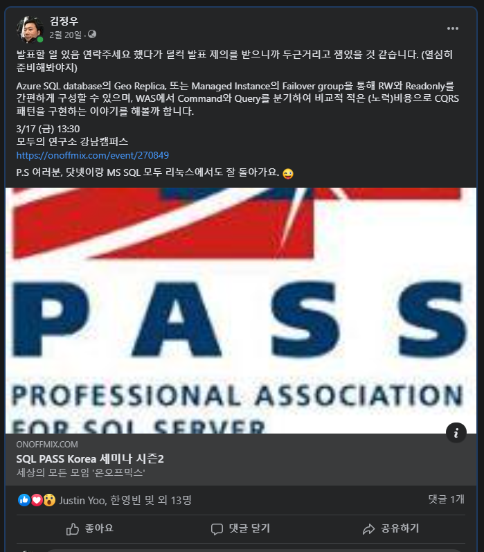-->
<!--
https://rokag3-gb.github.io/posts/2023-03-17-sql-pass-korea-seminar-azure-sql-failover-group/images/SQL PASS Korea Seminar Season 2 %EB%B0%9C%ED%91%9C 2023.03.17.pdf

[](https://rokag3-gb.github.io/posts/2023-03-17-sql-pass-korea-seminar-azure-sql-failover-group/images/SQL PASS Korea Seminar Season 2 %EB%B0%9C%ED%91%9C 2023.03.17.pdf)

# 발표 자료

1

<html>
<object data="https://rokag3-gb.github.io/posts/2023-03-17-sql-pass-korea-seminar-azure-sql-failover-group/images/SQL PASS Korea Seminar Season 2 %EB%B0%9C%ED%91%9C 2023.03.17.pdf" type="application/pdf" width="700px" height="700px">
    <embed src="https://rokag3-gb.github.io/posts/2023-03-17-sql-pass-korea-seminar-azure-sql-failover-group/images/SQL PASS Korea Seminar Season 2 %EB%B0%9C%ED%91%9C 2023.03.17.pdf">
        <p>This browser does not support PDFs. Please download the PDF to view it: <a href="https://rokag3-gb.github.io/posts/2023-03-17-sql-pass-korea-seminar-azure-sql-failover-group/images/SQL PASS Korea Seminar Season 2 %EB%B0%9C%ED%91%9C 2023.03.17.pdf">Download PDF</a>.</p>
    </embed>
</object>
</html>

2

<html>
<embed type="application/pdf" src="https://rokag3-gb.github.io/posts/2023-03-17-sql-pass-korea-seminar-azure-sql-failover-group/images/SQL PASS Korea Seminar Season 2 %EB%B0%9C%ED%91%9C 2023.03.17.pdf" width="100%" height="9000px">
</html>

3

---

4

<html>
<iframe
      class="slide"
      src="https://rokag3-gb.github.io/posts/2023-03-17-sql-pass-korea-seminar-azure-sql-failover-group/images/SQL PASS Korea Seminar Season 2 %EB%B0%9C%ED%91%9C 2023.03.17.pdf"
      width="50%"
      height="500px"
    ></iframe>
</html>

5
```
{% pdf https://rokag3-gb.github.io/posts/2023-03-17-sql-pass-korea-seminar-azure-sql-failover-group/images/SQL PASS Korea Seminar Season 2 %EB%B0%9C%ED%91%9C 2023.03.17.pdf %}
```

{% pdf https://rokag3-gb.github.io/posts/2023-03-17-sql-pass-korea-seminar-azure-sql-failover-group/images/SQL PASS Korea Seminar Season 2 %EB%B0%9C%ED%91%9C 2023.03.17.pdf %}

<html>
{% pdf https://rokag3-gb.github.io/posts/2023-03-17-sql-pass-korea-seminar-azure-sql-failover-group/images/SQL PASS Korea Seminar Season 2 %EB%B0%9C%ED%91%9C 2023.03.17.pdf %}
</html>

6

```
{% pdf ./images/SQL PASS Korea Seminar Season 2 %EB%B0%9C%ED%91%9C 2023.03.17.pdf %}
```

{% pdf ./images/SQL PASS Korea Seminar Season 2 %EB%B0%9C%ED%91%9C 2023.03.17.pdf %}

<html>
{% pdf ./images/SQL PASS Korea Seminar Season 2 %EB%B0%9C%ED%91%9C 2023.03.17.pdf %}
</html>

7

<iframe src="https://rokag3-gb.github.io/posts/2023-03-17-sql-pass-korea-seminar-azure-sql-failover-group/images/SQL PASS Korea Seminar Season 2 %EB%B0%9C%ED%91%9C 2023.03.17.pdf" style="width:100%; height:600px;" frameborder="0"></iframe>

8

<html>
<iframe src="https://rokag3-gb.github.io/posts/2023-03-17-sql-pass-korea-seminar-azure-sql-failover-group/images/SQL PASS Korea Seminar Season 2 %EB%B0%9C%ED%91%9C 2023.03.17.pdf" style="width:100%; height:600px;" frameborder="0"></iframe>
</html>

9

```html
<p>This is an example of HTML code.</p>
<div class="my-div">This is a div element.</div>
\```

위와 같이 작성하면 코드 블록이 생성되며, Hexo는 해당 코드를 그대로 HTML로 인식하여 블로그에서 코드를 표시할 것입니다.

여러 줄의 코드 블록을 생성하려면 백틱을 세 개 붙이면 됩니다. 아래는 예시입니다:

10

````html
<p>This is an example of HTML code.</p>
<div class="my-div">This is a div element.</div>
\````

11

```html
<iframe src="https://rokag3-gb.github.io/posts/2023-03-17-sql-pass-korea-seminar-azure-sql-failover-group/images/SQL PASS Korea Seminar Season 2 %EB%B0%9C%ED%91%9C 2023.03.17.pdf" style="width:100%; height:600px;" frameborder="0"></iframe>
```

12

````html
<iframe src="https://rokag3-gb.github.io/posts/2023-03-17-sql-pass-korea-seminar-azure-sql-failover-group/images/SQL PASS Korea Seminar Season 2 %EB%B0%9C%ED%91%9C 2023.03.17.pdf" style="width:100%; height:600px;" frameborder="0"></iframe>
````

13

<iframe src="https://www.slideshare.net/slideshow/embed_code/key/ux3JY2awIl63Qc?hostedIn=slideshare&page=upload" width="476" height="400" frameborder="0" marginwidth="0" marginheight="0" scrolling="no"></iframe>

14

[](https://www.slideshare.net/JungwooKim41/sql-pass-korea-seminar-season-2-azure-sql-database-geo-replica-managed-instancefailover-group-cqrs)

https://recruit.hmglobal.com/careers/list.asp

15

https://present.do/documents/64aa85c910ab9a5ae55bad48

16

<iframe src="https://present.do/documents/64aa85c910ab9a5ae55bad48" style="width:100%; height:600px;" frameborder="0"></iframe>

17
-->

---
`eof`