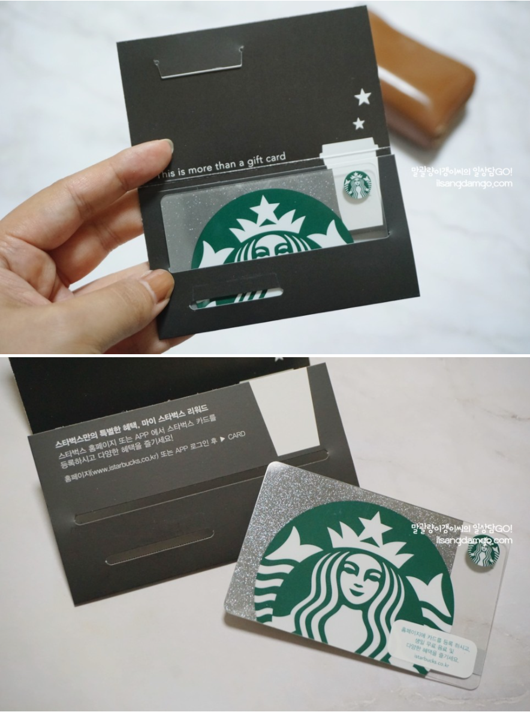

---
# Common-Defined params
title: "Grand open"
date: "2015-11-02"
description: "Example article description"
# images: ['logos/LT20210714.jpg']
categories:
  - "story"
tags:
  - "Grand open"
menu: main # Optional, add page to a menu. Options: main, side, footer

# Theme-Defined params
thumbnail: "img/giftcard.png" # Thumbnail image
lead: "rokag3-gb.github.io 블로그를 개설하였습니다." # Lead text
comments: true # Enable Disqus comments for specific page
authorbox: true # Enable authorbox for specific page
pager: true # Enable pager navigation (prev/next) for specific page
toc: true # Enable Table of Contents for specific page
mathjax: true # Enable MathJax for specific page
sidebar: "right" # Enable sidebar (on the right side) per page
widgets: # Enable sidebar widgets in given order per page
  - "recent"
  - "taglist"
---

# 대제목

Hello World! rokag3-gb.github.io 블로그를 개설하였습니다.



GarlicBread IT 입니다.

널리 많은 분들이 보셨으면 좋겠습니다.

## 중간 제목


select  getdate();

select  getdate();
select  getdate();


## 중제목

home = "right" # Configure layout for home page
home = "right" # Configure layout for home page
home = "right" # Configure layout for home page

### 상세 제목

[Params.sidebar]
  home = "right" # Configure layout for home page
  list = "left"  # Configure layout for list pages
  single = true # Configure layout for single pages
  #widgets = ["search", "recent", "categories", "taglist", "social", "languages"]
  widgets = ["recent", "categories", "taglist", "social", "languages"]

[Params.widgets]
  recent_num = 5 # Set the number of articles in the "Recent articles" widget
  categories_counter = true # Enable counter for each category in "Categories" widget
  tags_counter = true # Enable counter for each tag in "Tags" widget