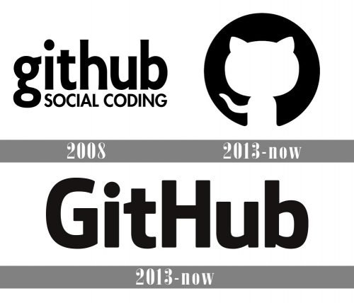

---
# Common-Defined params
title: "Grand open"
date: "2015-11-02"
description: "나는 GarlicBread 입니다. Go로 작성된 정적 사이트 생성기 Hugo를 기반으로 커스텀한 rokag3-gb.github.io 블로그를 개설하였습니다."
images: ['img/GitHub-Logo-history-500x428.jpg']
categories:
  - "story"
tags:
  - "Grand open"
menu: main # Optional, add page to a menu. Options: main, side, footer

# Theme-Defined params
thumbnail: "img/avatar.jpg" # Thumbnail image
lead: "rokag3-gb.github.io 블로그를 개설하였습니다." # Lead text
comments: true # Enable Disqus comments for specific page
authorbox: true # Enable authorbox for specific page
pager: true # Enable pager navigation (prev/next) for specific page
toc: true # Enable Table of Contents for specific page
mathjax: true # Enable MathJax for specific page
sidebar: "left" # Enable sidebar (on the right side) per page
widgets: # Enable sidebar widgets in given order per page
  - "recent"
  - "taglist"
---

# 대제목 - 첫번째 대제목

## 중제목 - 블로그 개설

Hello World! 나는 GarlicBread 입니다.

rokag3-gb.github.io 블로그를 개설하였습니다.

Go로 작성된 정적 사이트 생성기 Hugo를 기반으로 작업하였습니다.

가 개발한 cactus theme가 적용되어 있습니다.  


markdown 안에서 openinnewtab을 활용해서 하이퍼링크를 새탭으로 여는 테스트 입니다.  


[이 하이퍼링크를 누르면 현재 페이지에서 바로 이동합니다.](https://rokag3-gb.github.io/)

## markdown 연습

### 이미지

### 인용구, 리스트, 체크박스, 폰트, code block

> 인용구 테스트  
> 인용구 테스트 두번째 줄

리스트 & 체크박스 테스트
- [x] 항목 1번
  - [ ] 1.1 세부항목
  - [x] 1.2 세부항목
- [x] 항목 2번
  - 2.1 세부항목
  - 2.2 세부항목
    - 2.2.1 블라블라
    - 2.2.2
  - [ ] 2.3 세부항목
- [ ] 항목 3번
  - [ ] 3.1 이렇게 체크박스를 리스트 안에 넣을 수 있습니다.

---

_이탤릭_ 은 underscore(_)를 앞뒤로 묶어주고,  
**볼드체** 은 ** 을 앞뒤로 묶어주고,  
~~취소선~~ 은 ~~ 을 앞뒤로 묶어주면 됩니다.

`code block` 은 grave(물결표시 아래 작은따옴표) 로 묶어주면 됩니다.

### C#.NET syntax highlight

C# 소스코드 샘플 입니다.


// C#.NET syntax highlight sample
namespace myapp
{
    internal static class Program
    {
        /// 

        ///  The main entry point for the application.
        /// 

        [STAThread]
        static void Main()
        {
            ApplicationConfiguration.Initialize();

            Application.Run(new Form1());
        }
    }
}


### SQL syntax highlight


/* SQL syntax highlight sample */
select  getdate();

-- 한줄 주석
select  *
from  dbo.Deal
where 거래일 between '2013-01-01' and '2013-12-31';


### table

|col1|col2|col3|
|--|--|--|
|value1|value2|value3|

흠 table은 조금 별로군요.