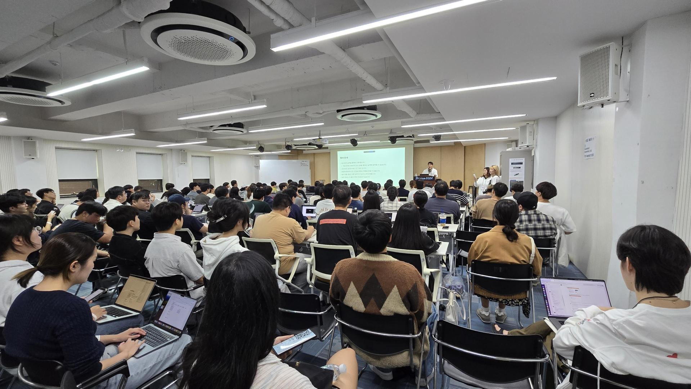
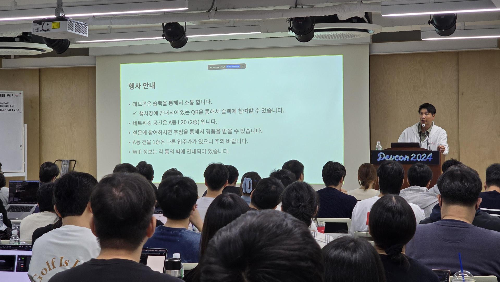
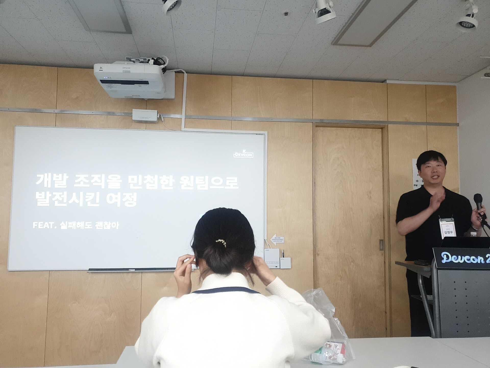
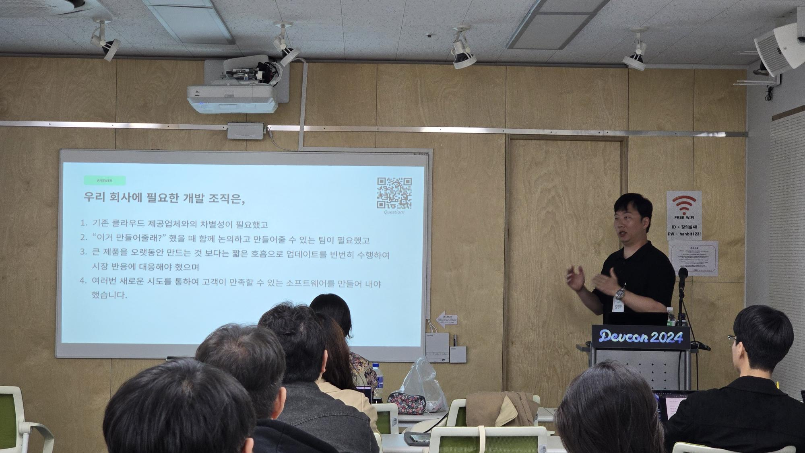
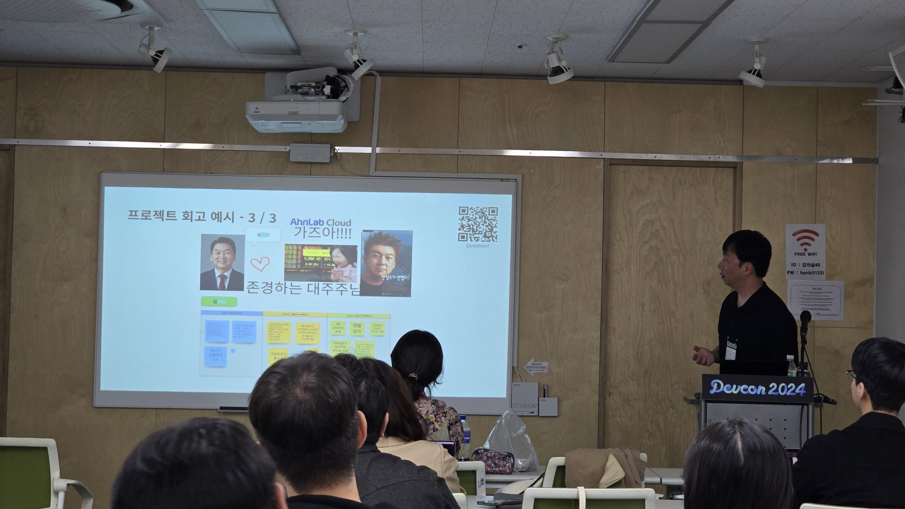

# DEVCON 2024 컨퍼런스 개요

2024.10.12 (토) 한빛앤 사옥(홍대) 13:00 ~ 18:00

https://festa.io/events/5916

성욱님의 긴급 요청을 받아 연사자로 합류

이런 엄청난 연사분들을 하루에 한 자리에 모으다니... K-DEVCON 섭외력 엄청난 듯.

# 현장 사진

# 발표 내용

[DEVCON 2024 - 개발 조직을 민첩한 원팀으로 발전시킨 여정 - 김정우.pdf](https://drive.google.com/file/d/1O7eWoDBqAN_iXjCKrLz74wnQNsB5t2ld/view?usp=sharing)

https://k-devcon.com/entry/DEVCON-2024-발표-자료-공유