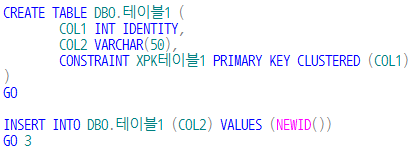
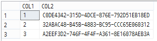
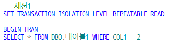
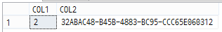
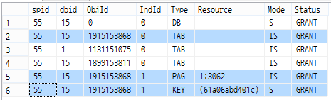
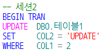

## Repeatable read isolation lavel

SQL Server의 repeatable read isolation lavel 이 궁금해서 테스트 해봤습니다. (반복 읽기)

일단 테이블 만들구요. insert 명령을 3번 실행해보겠습니다. (GO 3)

아래와 같이 데이터가 담겨 있습니다.

---

먼저 세션1 에서,

위 쿼리를 실행하면 아래처럼 조회가 되겠지요.

SP_LOCK 를 통해서 확인해보면 아래와 같이 페이지, 테이블은 IS(내재된공유), 키는 S(공유)가 된 것을 확인할 수 있습니다.

---

그럼 이제 세션2 에서,

동일한 자원의 동일한 키에 대해 UPDATE 를 시도하면?  
☞ 해당 자원의 업데이트 잠금(mode : U)을 획득하지 못하여 무한루프에 빠지게 됩니다.

즉, Repeatable read 격리 수준 에서는  
세션1 에서 SELECT 를 통한 공유잠금(MODE : S) 이지만  
세션1 이 COMMIT 또는 ROLLBACK 되기 전까지는  
세션2 의 UPDATE 를 허용하지 않습니다.  
세션1 의 SELECT 는 반복적 (repeatable)으로 가능한 상황이지요.

## 결론

다시 정리해보자면,  
`한 세션의 트랜잭션이 진행 중일 때는 외부에서 데이터의 변경을 차단하고 동일한 세션에서는 동일한 데이터를 계속 읽을수 있는 구조가 필요할 때` 활용 가능한 격리 수준이 되겠습니다.

외부로부터의 UPDATE에 대한 트랜잭션으로 부터 잠금이 획득되지만 데이터의 INSERT 까지는 차단되지 않습니다.

SELECT 한 결과가 항상 동일하다는 것은 아니다 라는 것은 주의해야 겠네요.