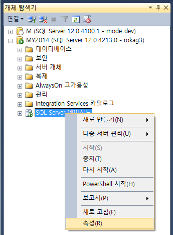
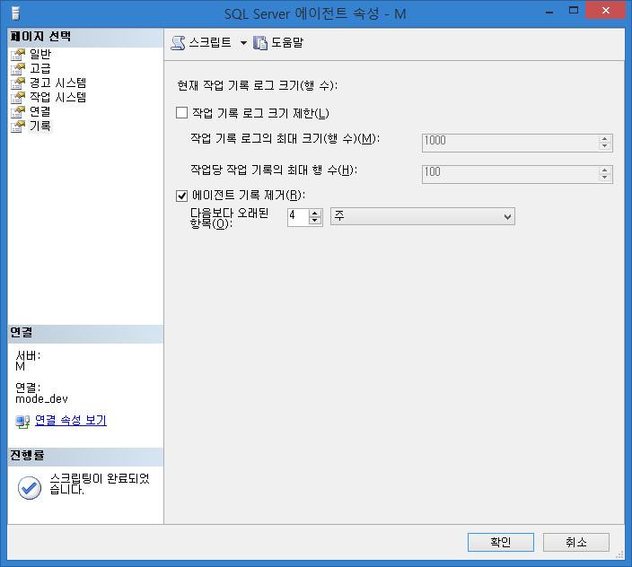
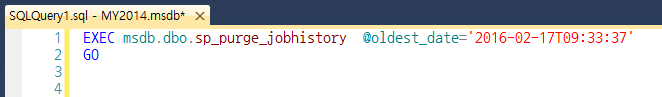

## 에이전트 기록 제거

SQL Server Management Studio (SSMS) 에서 "SQL Server 에이전트" 의 기록을 어느 정도(?) 관리할 수 있도록 되어 있습니다.

"에이전트 기록 제거" 체크를 앞으로의 기록을 자동적으로 제거하는 설정으로 오해를 하신 분들이 있을 수 있겠다 싶어 포스팅 하게 되었습니다. 실제로 제가 그런줄 알았었지요. 😝





## 오해

기록 페이지를 보면, "에이전트 기록 제거" 체크가 있습니다. 여기서 약간의 오해를 할 수 있는 부분이 있는데요. "에이전트 기록 제거" 체크를 하면 다음보다 오래된 항목 기준(예:4주)의 기록들을 앞으로도 계속 자동으로 제거하게 하는 설정이라고 오해할만한 소지가 있습니다.

"에이전트 기록 제거" 체크를 하고 상단에 "스크립트" 버튼을 눌러보면 아래와 같이 쿼리가 나오게 됩니다.



msdb 안에 있는 sp_purge_jobhistory 라는 sp 를 sp_helptext 로 까보면 "다음보다 오래된 항목" 조건에 해당하는 msdb.dbo.sysjobhistory 를 delete 하는것을 확인할 수 있습니다.

즉, 현재 상황에서 기준에 해당하는 기록을 지우는 것이지, 향후에 생성될 기록들에 대한 제거 예약 작업은 아니라는 것 입니다.

## job 실행 기록을 자동으로 지우고 싶다면

기록을 자동으로 지우고자 한다면 아래의 쿼리를 실행하는 별도의 job 을 등록해야할 것 입니다.

```sql
declare @date datetime;
set @date = dateadd(month, -1, getdate());

-- @date 보다 오래된 msdb.dbo.sysjobhistory 를 delete
exec msdb.dbo.sp_purge_jobhistory @oldest_date = @date;
```

이상으로 자기 혼자 오해해놓고 제목은 엄청 심오하게 써놓은 낚시성 포스팅을 마치겠습니다.